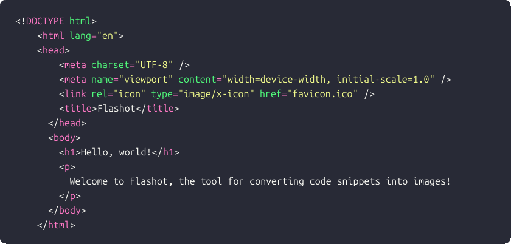

# Flashot

[](https://npmjs.com/package/flashot)
[](https://npm.chart.dev/flashot)

> 📟 Rapidly convert code snippets into images

**Super fast:** (generated in **~150ms**)

<p align="center">
  
</p>

## Usage

```js
import { writeFile } from "node:fs/promises";
import { codeToImage } from "flashot";

const buffer = await codeToImage('console.log("hello, world!");');
await writeFile("image.png", buffer);
```

## Options

### `lang`

Code language. See [shiki supported languages](https://shiki.style/languages)

### `theme`

Rendering theme. See [shiki supported theems](https://shiki.style/themes).

### `style`

Additional container styles. See [takumi stylesheets](https://takumi.kane.tw/docs/deep-dives/stylesheets).

### `font`

Font used to render the code. Can be either a string (remote URL to fetch) or an ArrayBuffer.

### `width`

Rendering width. By default is computed as `(columns + 2) * 10`.

### `height`

Rendering height. By default is computed as `(lines + 2) * 20`.

## Features

### 🚀 Core Technologies

- **[Bun](https://bun.sh)** - Fast all-in-one JavaScript runtime and toolkit
- **[TypeScript](https://www.typescriptlang.org/)** - Type-safe development with strict mode enabled
- **[Vite](https://vitejs.dev/)** - Lightning-fast build tool with optimized bundling
- **[Vitest](https://vitest.dev/)** - Blazing fast unit testing framework
- **[shiki](https://github.com/shikijs/shiki)** and **[takumi](https://github.com/kane50613/takumi)**
- **Dual Module Support** - ESM and CommonJS output with proper type definitions
- **[Biome](https://biomejs.dev/)** - Fast formatter and linter for consistent code style
- **[ESLint](https://eslint.org/)** - Advanced linting with TypeScript and SonarJS rules
- **Git Hooks** - Automated quality checks via Lefthook and Commitlint
- **Gitmoji Commits** - Structured commit messages with emoji conventions
- **Watch Mode** - Hot rebuild during development

### 📊 Quality Assurance

- **Test Coverage** - Built-in coverage reporting with v8
- **UI Testing** - Interactive test UI with `@vitest/ui`
- **Pre-commit Hooks** - Automatic linting and formatting on commit
- **Pre-push Validation** - Full build and test suite before pushing

## Quick Start

### Initial Setup

1. **Install dependencies:**

   ```bash
   bun install
   ```

2. **Configure Git hooks:**

   ```bash
   lefthook install
   ```

3. **Update package metadata:**
   - Edit `package.json` to set your library name, description, and repository details
   - Update the author information
   - Add relevant keywords for npm discovery

## Development Workflow

### Available Scripts

```bash
# Development
bun run dev          # Watch mode with auto-rebuild
bun run build        # Production build

# Testing
bun test            # Run tests
bun test:ui         # Interactive test UI
bun test:coverage   # Generate coverage report

# Code Quality
bun run lint        # Run ESLint
bun run lint:fix    # Auto-fix ESLint issues
bun run biome       # Run Biome checks
bun run biome:fix   # Auto-fix Biome issues
bun run check       # Run all checks
bun run check:fix   # Fix all auto-fixable issues
```

## Project Structure

```
├── .config/                 # Configuration files
│   ├── commitlint.config.ts  # Commit message rules
│   ├── eslint.config.ts      # ESLint configuration
│   └── lefthook.yml          # Git hooks configuration
├── src/                     # Source code
│   └── index.ts            # Library entry point
├── test/                    # Test files
│   └── index.test.ts       # Unit tests
├── dist/                    # Build output (generated)
│   ├── index.js            # ESM bundle
│   ├── index.cjs           # CommonJS bundle
│   └── index.d.ts          # TypeScript definitions
├── biome.json              # Biome formatter/linter config
├── tsconfig.json           # TypeScript configuration
├── vite.config.ts          # Vite build configuration
└── vitest.config.ts        # Vitest test configuration
```

## Configuration Details

### TypeScript Configuration

- Strict mode enabled with additional safety checks
- Modern ESNext target with bundler-optimized module resolution
- Comprehensive type checking including:
  - No unchecked indexed access
  - No implicit overrides
  - No unused locals/parameters
  - No fallthrough cases in switch statements

### Build Configuration

- Dual package support (ESM + CommonJS)
- Automatic TypeScript declaration generation
- Tree-shaking enabled
- Minification in production builds

### Code Quality Tools

#### Biome

- Fast, Rust-based formatter and linter
- Consistent code style with tab indentation
- Double quotes for strings
- Automatic import organization

#### ESLint

- TypeScript-specific rules
- SonarJS plugin for code quality
- Configured for both browser and Node.js globals

#### Git Hooks (via Lefthook)

- **Pre-commit**: Runs ESLint and Biome on staged files
- **Commit-msg**: Validates commit message format (Gitmoji)
- **Pre-push**: Full lint, format check, and build validation

## Publishing Your Library

1. **Update version:**

   ```bash
   npm version patch|minor|major
   ```

2. **Build the library:**

   ```bash
   bun run build
   ```

3. **Publish to npm:**
   ```bash
   npm publish
   ```

The `prepublishOnly` script ensures your library is built before publishing.

## Contributing

Contributions are welcome! This starter kit uses:

- Gitmoji commit convention for clear commit messages
- Automated code formatting and linting
- Comprehensive test coverage requirements

Please ensure all tests pass and code quality checks succeed before submitting a PR.

## License

MIT - See [LICENSE](./LICENSE) file for details

## Author

Tran Nguyen Thuong Truong <thuongtruongofficial@gmail.com>

## Acknowledgments

This starter kit builds upon best practices from the Bun and TypeScript communities, incorporating modern tooling for an optimal developer experience.

<!-- https://github.com/bunup/bunup -->

<!-- https://github.com/pedro199288/bun-library-starter -->
