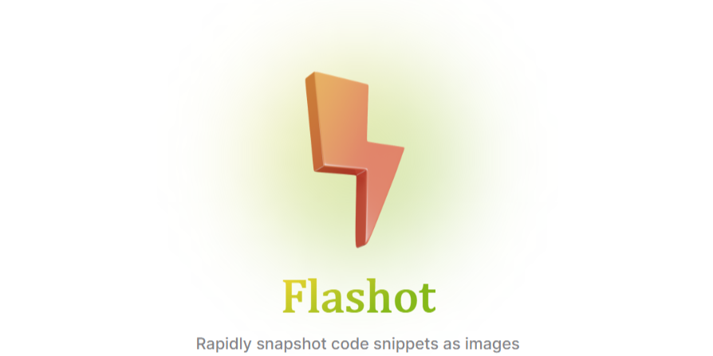
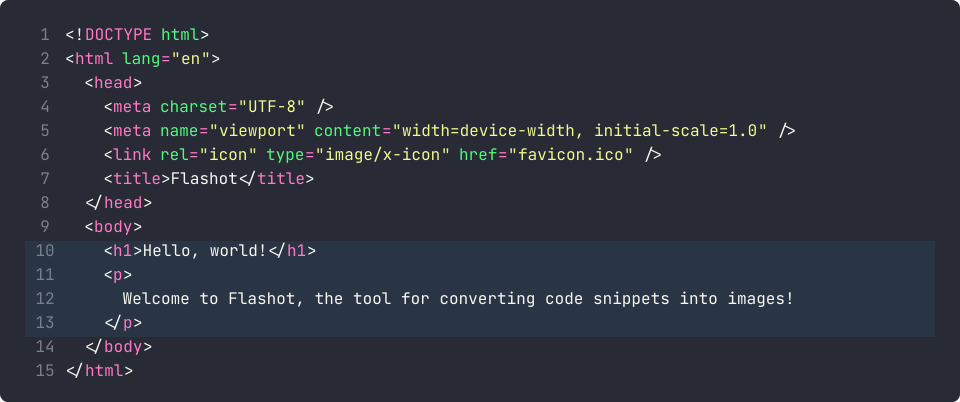

<div align="center">

<picture>
    <source media="(prefers-color-scheme: dark)" srcset="./public/banner_dark.png">
    
</picture>


[](https://npmjs.com/package/flashot)
[](https://npmjs.com/package/flashot)
[](https://jsr.io/@thuongtruong/flashot)
[](https://jsr.io/@thuongtruong/flashot/score)
[](https://www.jsdocs.io/package/flashot)
[](https://github.com/sponsors/thuongtruong109)
[](https://bundlephobia.com/package/flashot)
[](https://bundlephobia.com/package/flashot)
[](https://github.com/antfu/vite-unbundled/blob/main/LICENSE)

**Flashot** is the **blazing-fast image generation tool** for code snippets with elegant design and flawless performance

</div>

<div align="center">

**Super fast:** (generated in **~135ms**)

  
</div>

## ✨ Features

- 💻 **Inline code support:** Easily convert inline code snippets to images
- 🌐 **URL support:** Fetch code snippets directly from URLs
- 🗂️ **File support:** Convert code snippets from local files
- 🗃️ **Buffer support:** Convert code snippets from buffers
- 🎨 **Customizable styles:** Choose from various options to match your style
- 🖼️ **High-quality output:** Generates crisp and clear images which keep the original code's formatting intact
- ⚡ **Blazing fast:** Optimized for speed, ensuring quick image generation
- 🛠️ **Easy to use:** Easy to integrate into your projects with a simple API
- 🪓 **Multi-format support:** Generate images in various formats (PNG, JPEG, WebP)
- 🔷 **TypeScript support:** Fully typed for better developer experience
- 🔍 **Extensive testing:** Thoroughly tested with a comprehensive suite of unit tests
- 🔋 **Easy integration:** Simple API for seamless integration into your projects
- 📦 **Lightweight:** Minimal dependencies to keep your project lean
- 📏 **Line numbers:** Support for displaying & customizing line numbers
- 🖍️ **Highlighting:** Support for custom syntax highlighting
- 🗂️ **Render caching:** Efficiently handles caching for improved performance (render, tokens, sizes, fonts)
- 🔧 **Flexible environment support:** Works seamlessly in various environments (Node.js, Bun, Deno, Workers, …)

## 📦 Installation

```bash
npm install flashot
```

```bash
yarn add flashot
```

```bash
pnpm add flashot
```

```bash
bun install flashot
```

```bash
deno add jsr:@thuongtruong109/flashot
```

```bash
npx jsr add @thuongtruong/flashot
```

## 🪔 Usage Example

##### For inline code

```js
import { writeFile } from "node:fs/promises";
import { codeToImg } from "flashot";

const buffer = await codeToImg('console.log("hello, world!");', {
  /* add more options*/
});
await writeFile("inline.webp", buffer);
```

##### For raw content url

```js
import { writeFile } from "node:fs/promises";
import { urlToImg } from "flashot";

const buffer = await urlToImg(
  "https://mdn.github.io/learning-area/javascript/oojs/json/superheroes.json",
  {
    /* add more options*/
    format: OutputFormat.Png,
  }
);
await writeFile("url.png", buffer);
```

##### For buffer

```js
import { writeFile } from "node:fs/promises";
import { bufferToImg } from "flashot";

const buffer =
  "<Buffer 54 68 69 73 20 69 73 20 61 20 62 75 66 66 65 72 20 65 78 61 6d 70 6c 65 2e>";
const img = await bufferToImg(buffer, {
  /* add more options*/
});
await writeFile("buffer.png", img);
```

##### For path dir

```js
import { writeFile } from "node:fs/promises";
import { pathToImg } from "flashot";

const img = await pathToImg("../package.json", {
  /* add more options*/
});
await writeFile("path.png", img);
```

👉 Then you can use the `buffer` to display the image or send it in a response.

## ⚙️ API Options (default is not needed)

```js
const defaultOptions = {
  lang: "ts", // default is javascript
  theme: "ayu-dark", // default is github-dark
  font: "https://fonts.bunny.net/ubuntu-sans-mono/files/ubuntu-sans-mono-latin-400-normal.woff2", // default is bunny.net/jetbrains-mono.
  format: OutputFormat.Png, // default is OutputFormat.Webp (options: OutputFormat.Png, OutputFormat.Jpeg, OutputFormat.Webp)
  quality: 100, // default is 100 (1-100), only applies to JPEG formats
  width: 800, // default is system's width
  height: 400, // default is system's height
  bg: "transparent", // default is system's background
  gap: 1, // gap between lines (default is 1)
  style: {
    borderRadius: 10, // default is 8
    padding: 30, // default is 25
    // ... more custom styles
  },
  lineNumbers: {
    enabled: true, // default is false
    startFrom: 5, // default is 1
    color: "#d64141ff", // default is #7b7f8b
    marginRight: 2, // default is 0
  },
  highlight: {
    enabled: true, // default is false
    backgroundColor: "#25ce5da1", // default is #347faa23,
    borderRadius: 2, // default is 0
    at: 2, // start from at line - default is 1
    depth: 3, // total lines - default is 1
  },
};
```

| Option        | Description                                                                              | Default                                                                                                |
| ------------- | ---------------------------------------------------------------------------------------- | ------------------------------------------------------------------------------------------------------ |
| `lang`        | Code language ([supported](https://shiki.style/languages))                               | `"js"`                                                                                                 |
| `theme`       | Rendering theme ([supported](https://shiki.style/themes))                                | `"github-dark"`                                                                                        |
| `font`        | Font for rendering (URL or ArrayBuffer)                                                  | [`Jetbrains Mono`](https://fonts.bunny.net/jetbrains-mono/files/jetbrains-mono-latin-400-normal.woff2) |
| `format`      | Output image format (`OutputFormat.Png`, `OutputFormat.Jpeg`, `OutputFormat.Webp`)       | `OutputFormat.Webp`                                                                                    |
| `quality`     | Image quality (1-100) for JPEG formats                                                   | `100`                                                                                                  |
| `width`       | Image width                                                                              | System default                                                                                         |
| `height`      | Image height                                                                             | System default                                                                                         |
| `bg`          | Background color                                                                         | Theme's background                                                                                     |
| `gap`         | Gap between lines                                                                        | `1`                                                                                                    |
| `style`       | Additional container styles ([docs](https://takumi.kane.tw/docs/deep-dives/stylesheets)) | `{ borderRadius: 8, padding: 25 }`                                                                     |
| `lineNumbers` | Line number styles                                                                       | `{ enabled: false, color: '#7b7f8b', marginRight: 0 }`                                                 |
| `highlight`   | Syntax highlighting styles                                                               | `{ enabled: false, backgroundColor: '#347faa23', borderRadius: 0, at: 1, depth: 1 }`                   |

## 🧪 Code Coverage

| File      | % Stmts | % Branch | % Funcs | % Lines | Uncovered Line #s |
| --------- | ------- | -------- | ------- | ------- | ----------------- |
| All files | 99.17   | 81.25    | 100     | 99.17   |
| core.ts   | 100     | 100      | 100     | 100     |
| index.ts  | 100     | 100      | 100     | 100     |
| shared.ts | 100     | 100      | 100     | 100     |
| utils.ts  | 98.36   | 78.57    | 100     | 98.36   | 67                |


## 🏁 Benchmarks

| No  | Task name  | Latency avg (ns)   | Latency med (ns)      | Throughput avg (ops/s) | Throughput med (ops/s) | Samples |
| --- | ---------- | ------------------ | --------------------- | ---------------------- | ---------------------- | ------- |
| 1   | 1 lines    | 10175455 ± 1.43%   | 10075900 ± 106800     | 99 ± 1.05%             | 99 ± 1                 | 99      |
| 2   | 10 lines   | 39056303 ± 0.45%   | 38845500 ± 405750     | 26 ± 0.44%             | 26 ± 0                 | 64      |
| 3   | 100 lines  | 343126433 ± 0.29%  | 343616650 ± 2711850   | 3 ± 0.29%              | 3 ± 0                  | 64      |
| 4   | 1000 lines | 1726190939 ± 0.46% | 1715535300 ± 13138650 | 1 ± 0.45%              | 1 ± 0                  | 64      |

## 📚 Technologies

- ⚡ **[Bun](https://bun.sh)** - Fast all-in-one JavaScript runtime and toolkit
- 🏗️ **[TypeScript](https://www.typescriptlang.org/)** - Type-safe development with strict mode enabled
- 📦 **[Vite](https://vitejs.dev/)** - Lightning-fast build tool with optimized bundling
- 🪓 **[Tsdown](https://rolldown/tsdown)** - A powerful tool for TypeScript package
- 🧪 **[Vitest](https://vitest.dev/)** - Blazing fast unit testing & interactive test UI framework
- 🎨 **[Shiki](https://github.com/shikijs/shiki)** and **[Takumi](https://github.com/kane50613/takumi)** - Render container highlight
- 📝 **[Biome](https://biomejs.dev/)** - Fast formatter and linter for consistent code style
- 🚀 **Dual Module Support** - ESM and CommonJS output with proper type definitions
- 🔥 **[ESLint](https://eslint.org/)** - Advanced linting with TypeScript and SonarJS rules
- 🧩 **[Lefthook](https://github.com/evilmartians/lefthook)** and **[Commitlint](https://commitlint.js.org/)** - Automated Git hooks for linting and formatting
- 🛠️ **[Tinybench](https://github.com/tinybench/tinybench)** - A tiny benchmarking library for measuring performance

## 🤝 Contributing

Contributions are welcome! This starter kit uses:

- Automated code formatting and linting
- Comprehensive test coverage requirements

Please ensure all tests pass and code quality checks succeed before submitting a PR.

> Check [CONTRIBUTING.md](./.github/CONTRIBUTING.md) for more information.

## 💬 Discussions

Head over to the [discussions](https://github.com/thuongtruong109/flashot/discussions/new/choose) to share your ideas.

## 📄 License

[MIT License](./LICENSE) - [Tran Nguyen Thuong Truong](mailto:thuongtruongofficial@gmail.com)

<!-- https://github.com/pi0/shiki-image -->
<!-- https://github.com/bunup/bunup -->
<!-- https://github.com/pedro199288/bun-library-starter -->
<!-- https://stackblitz.com/github/rolldown/tsdown-starter-stackblitz?file=tsconfig.json -->
<!-- https://dev.to/sojida/building-command-line-interface-cli-tools-with-nodejs-4mob -->
